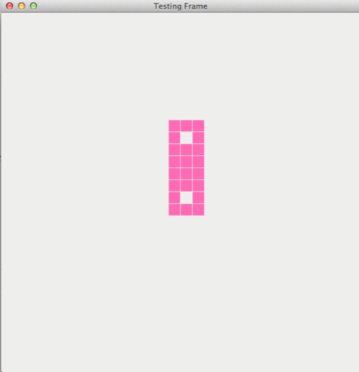

# GameOfLifeKata
GameOfLifeKata with @maaretp

Implementation of the game of life kata in java8.
The final result looks like this.

This was done Test Driven using [ApprovalTests](https://github.com/approvals/ApprovalTests.Java)  

The only part not covered by test is the threaded timer for the gui.

